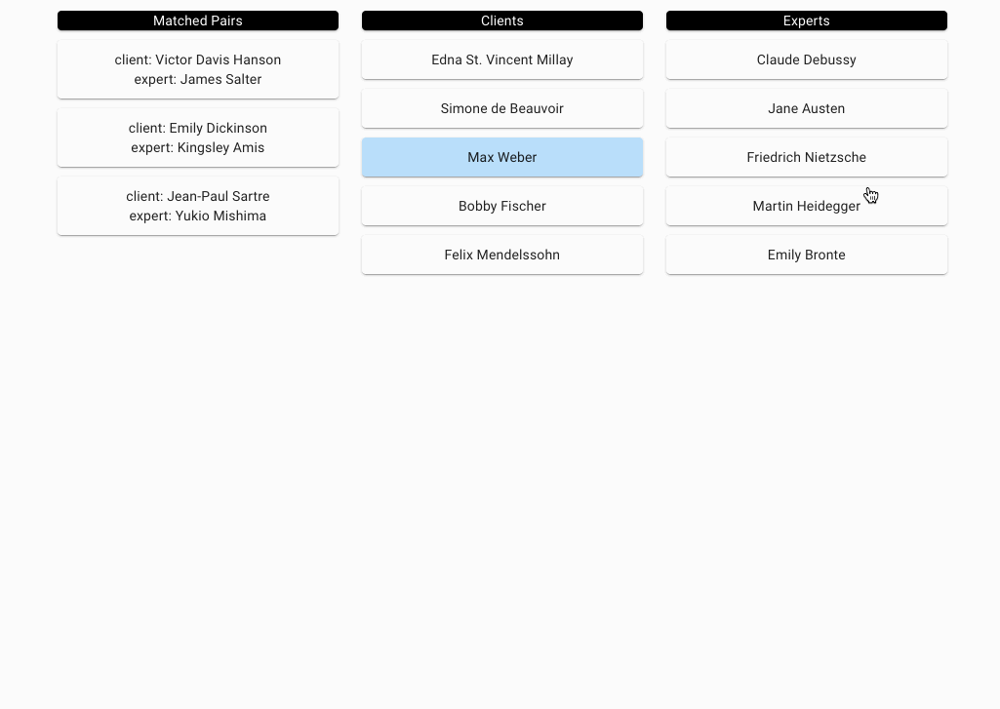

Matching Dashboard
==================

Installation
------------

This app uses ASDF for version management. To install dependencies using ASDF,
issue `asdf install` from the project root. Install library dependencies with
`bin/setup`. The database can be seeded with `bin/rails db:seed`.

Dependencies
------------

- Ruby
- Rails
- RSpec
- PostgreSQL
- Webpacker
- React.js
- Material UI

Versions in `.tool-versions`, `Gemfile`, and `package.json`.

Features
--------

- See a list of matched clients and experts
- Match unmatched clients and experts

Demo
--------

